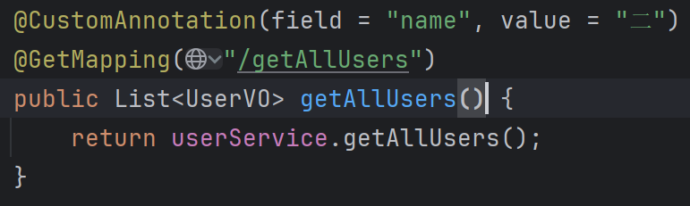
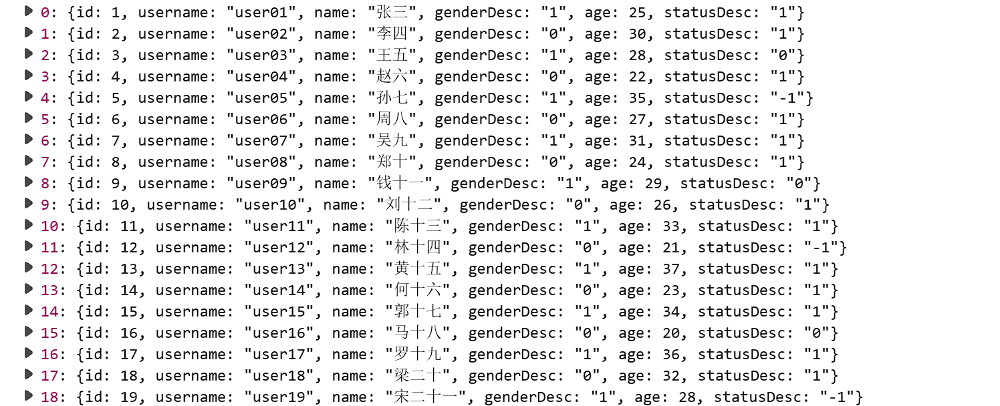
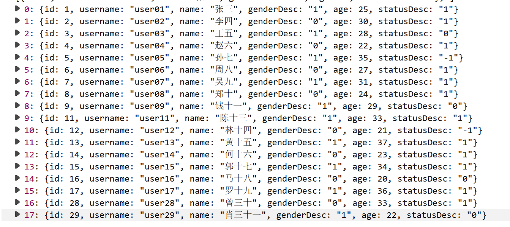

# demo介绍

## demo-CustomAnnotation-自定义注解

**“注解本身只是标记，真正的逻辑在处理器中”**

### 一、 核心概念与元注解（Meta-Annotations）

要定义一个新的注解，必须使用 **元注解** 来修饰它。Java 提供了5个标准元注解，Spring 又进行了扩展。

1. #### **`@Target`** ：指定注解可以应用的位置（ElementType）。

* `TYPE`：类、接口、枚举
* `FIELD`：字段
* `METHOD`：方法
* `PARAMETER`：参数
* `CONSTRUCTOR`：构造函数
* `ANNOTATION_TYPE`：注解

2. #### **`@Retention`** ：指定注解的保留策略（RetentionPolicy）。

* `SOURCE`：仅源码级别，编译器丢弃（如 `@Override`）
* `CLASS`：编译到 class 文件，但 JVM 不加载（默认）
* **`RUNTIME`** ： **最重要** 。编译到 class 文件，且被 JVM 加载，可以在运行时通过反射读取。 **Spring 自定义注解基本都是 RUNTIME** 。

3. #### **`@Documented`** ：表明该注解应该被 Javadoc 工具记录。
4. #### **`@Inherited`** ：允许子类继承父类上的注解。
5. #### **Spring 扩展元注解 `@AliasFor`** ：

* 用于为注解中的属性起别名，让两个属性语义上相同。
* 常用于组合注解（Composed Annotations），例如 `@GetMapping` 中的 `value` 和 `path`。

#### 定义一个注解

```java
// 指定注解可以应用的目标元素类型为TYPE和METHOD，表示该注解可以用于类、接口或方法上
@Target({ElementType.TYPE, ElementType.METHOD})
// 指定注解的保留策略为RUNTIME，表示该注解在运行时仍然有效，可以通过反射机制获取到该注解
@Retention(RetentionPolicy.RUNTIME)
public @interface CustomAnnotation {
    /**
     * 指定要过滤的字段名
     * 默认为空，表示不过滤
     */
    String field() default "";
    /**
     * 指定要过滤掉的值
     * 默认为空，表示不过滤
     */
    String value() default "";
}
```

### 二、 注解的处理(AOP)

```java
/**
 * 自定义注解切面类，用于处理带有CustomAnnotation注解的方法返回值过滤
*
 * @since 1.0
 */
@Aspect     //声明这是一个Aspect切面类，用于定义切面逻辑
@Component
public class CustomAnnotationAspect {
    /**
     * 环绕通知，处理带有CustomAnnotation注解的方法
*
     * @param joinPoint  切点
* @param annotation 注解
* @return 处理后的结果
* @throws Throwable 异常
*/
@Around("@annotation(annotation)")
    public Object around(ProceedingJoinPoint joinPoint, CustomAnnotation annotation) throws Throwable {
        // 执行原方法
Object result = joinPoint.proceed();

        // 获取注解参数
String field = annotation.field();
        String value = annotation.value();

        // 如果没有指定过滤字段或值，则直接返回原结果
if (field.isEmpty() || value.isEmpty()) {
            return result;
        }

        // 如果结果是List类型，则进行过滤处理
if (result instanceof List) {
            List<?> list = (List<?>) result;
            if (CollectionUtils.isEmpty(list)) {
                return list;
            }

            // 创建新的结果列表
List<Object> filteredList = new ArrayList<>();
            for (Object item : list) {
                if (item != null) {
                    // 检查对象是否包含指定字段且字段值不等于指定值
if (!shouldFilterOut(item, field, value)) {
                        filteredList.add(item);
                    }
                }
            }
            return filteredList;
        }

        return result;
    }

    /**
     * 判断对象是否应该被过滤掉
*
     * @param obj   对象
* @param field 字段名
* @param value 要过滤的值
* @return true-应该被过滤掉，false-不应该被过滤掉
*/
private boolean shouldFilterOut(Object obj, String field, String value) {
        try {
            // 获取对象的字段
Field objField = ReflectionUtils.findField(obj.getClass(), field);
            if (objField == null) {
                return false;
            }

            // 设置字段可访问
ReflectionUtils.makeAccessible(objField);

            // 获取字段值
Object fieldValue = ReflectionUtils.getField(objField, obj);
            if (fieldValue == null) {
                return false;
            }

            // 检查字段值是否包含指定的过滤值
return fieldValue.toString().contains(value);
        } catch (Exception e) {
            // 发生异常则不过滤
return false;
        }
    }
}
```

测试：

通过自定义注解，过滤掉所有带“二”的数据


成功过滤掉所有带“二”的数据：

