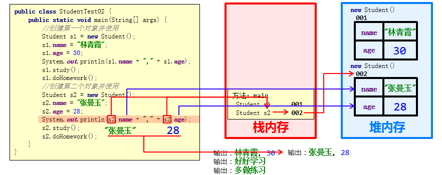

# 基础篇

## 内存

### ‌堆（Heap）：new关键字

  所有线程共享的内存区域，主要用于存放对象实例和数组。堆是动态分配的，大小不固定，只受物理内存大小限制。

### ‌栈（Stack）‌：执行方法

  线程私有的内存区域，每个方法执行都会创建一个新的栈帧。栈帧用于存储局部变量、操作数栈、动态链接、方法出口等信息。栈的大小在虚拟机启动时就已经确定。

### 内存图

成员变量使用过程


成员方法调用过程


### 多个对象内存图

成员变量使用过程



成员方法调用过程


> *以上4张图片来源于黑马*

## String

### 字符串长度与空值检查

| 方法                  | 描述                           | 示例                      |
| :-------------------- | :----------------------------- | :------------------------ |
| `int length()`      | 返回字符串长度                 | `str.length()` → 5     |
| `boolean isEmpty()` | 检查字符串是否为空             | `str.isEmpty()` → true |
| `boolean isBlank()` | 检查字符串是否为空白(Java 11+) | `str.isBlank()` → true |

### 字符串查找

| 方法                                  | 描述                               | 示例                                 |
| :------------------------------------ | :--------------------------------- | :----------------------------------- |
| `char charAt(int index)`            | 返回指定索引处的字符               | `"hello".charAt(1)` → 'e'         |
| `int indexOf(String str)`           | 返回指定子字符串第一次出现的索引   | `"hello".indexOf("l")` → 2        |
| `int lastIndexOf(String str)`       | 返回指定子字符串最后一次出现的索引 | `"hello".lastIndexOf("l")` → 3    |
| `boolean contains(CharSequence s)`  | 检查字符串是否包含指定字符序列     | `"hello".contains("ell")` → true  |
| `boolean startsWith(String prefix)` | 检查字符串是否以指定前缀开头       | `"hello".startsWith("he")` → true |
| `boolean endsWith(String suffix)`   | 检查字符串是否以指定后缀结尾       | `"hello".endsWith("lo")` → true   |

### 字符串截取

| 方法                                               | 描述                                 | 示例                                 |
| :------------------------------------------------- | :----------------------------------- | :----------------------------------- |
| `String substring(int beginIndex)`               | 返回从指定索引开始到末尾的子字符串   | `"hello".substring(2)` → "llo"    |
| `String substring(int beginIndex, int endIndex)` | 返回指定开始和结束索引之间的子字符串 | `"hello".substring(1, 4)` → "ell" |

### 字符串比较

| 方法                                               | 描述                     | 示例                                          |
| :------------------------------------------------- | :----------------------- | :-------------------------------------------- |
| `boolean equals(Object anObject)`                | 比较字符串内容是否相等   | `"hello".equals("hello")` → true           |
| `boolean equalsIgnoreCase(String anotherString)` | 忽略大小写比较字符串内容 | `"Hello".equalsIgnoreCase("hello")` → true |
| `int compareTo(String anotherString)`            | 按字典顺序比较两个字符串 | `"abc".compareTo("abd")` → -1              |
| `int compareToIgnoreCase(String str)`            | 忽略大小写的字典顺序比较 | `"A".compareToIgnoreCase("a")` → 0         |

### 字符串转换

| 方法                             | 描述                             | 示例                                      |
| :------------------------------- | :------------------------------- | :---------------------------------------- |
| `String toLowerCase()`         | 将字符串转换为小写               | `"HELLO".toLowerCase()` → "hello"      |
| `String toUpperCase()`         | 将字符串转换为大写               | `"hello".toUpperCase()` → "HELLO"      |
| `String trim()`                | 去除字符串首尾空白字符           | `" hello ".trim()` → "hello"           |
| `String strip()`               | 去除字符串首尾空白字符(Java 11+) | `" hello ".strip()` → "hello"          |
| `String[] split(String regex)` | 根据正则表达式分割字符串         | `"a,b,c".split(",")` → ["a", "b", "c"] |

### 字符串替换

| 方法                                                              | 描述                           | 示例                                          |
| :---------------------------------------------------------------- | :----------------------------- | :-------------------------------------------- |
| `String replace(char oldChar, char newChar)`                    | 替换所有出现的指定字符         | `"hello".replace('l', 'L')` → "heLLo"      |
| `String replace(CharSequence target, CharSequence replacement)` | 替换所有出现的指定字符序列     | `"hello".replace("ll", "LL")` → "heLLo"    |
| `String replaceAll(String regex, String replacement)`           | 使用正则表达式替换所有匹配项   | `"a1b2".replaceAll("\\d", "-")` → "a-b-"   |
| `String replaceFirst(String regex, String replacement)`         | 使用正则表达式替换第一个匹配项 | `"a1b2".replaceFirst("\\d", "-")` → "a-b2" |

### 正则表达式

| 方法                              | 描述                               | 示例                              |
| :-------------------------------- | :--------------------------------- | :-------------------------------- |
| `boolean matches(String regex)` | 检查字符串是否匹配给定的正则表达式 | `"123".matches("\\d+")` → true |

### 其他实用方法

| 方法                                                                     | 描述                         | 示例                                                                        |
| :----------------------------------------------------------------------- | :--------------------------- | :-------------------------------------------------------------------------- |
| `static String join(CharSequence delimiter, CharSequence... elements)` | 使用指定分隔符连接多个字符串 | `String.join("-", "a", "b", "c")` → "a-b-c"                              |
| `String repeat(int count)`                                             | 重复字符串指定次数(Java 11+) | `"ab".repeat(3)` → "ababab"                                              |
| `String format(String format, Object... args)`                         | 格式化字符串                 | `String.format("Name: %s, Age: %d", "John", 25)` → "Name: John, Age: 25" |
| `static String valueOf(Object obj)`                                    | 将对象转换为字符串表示形式   | `String.valueOf(123)` → "123"                                            |

### String、StringBuffer 和 StringBuilder 的区别

| 特性               | String               | StringBuilder            | StringBuffer                      |
| :----------------- | :------------------- | :----------------------- | :-------------------------------- |
| **可变性**   | 不可变               | 可变                     | 可变                              |
| **线程安全** | 是（由于不可变性）   | 否                       | 是（通过 `synchronized`关键字） |
| **性能**     | 较低（频繁操作时）   | 高                       | 中等                              |
| **使用场景** | 字符串常量或少量操作 | 单线程环境下的字符串操作 | 多线程环境下的字符串操作          |
| **存储位置** | 字符串常量池         | 堆内存                   | 堆内存                            |

## ArrayList

##### 构造方法

| 方法名             | 说明                 |
| ------------------ | -------------------- |
| public ArrayList() | 创建一个空的集合对象 |

##### 成员方法

| 方法名                              | 说明                                   |
| ----------------------------------- | -------------------------------------- |
| public boolean add(要添加的元素)    | 将指定的元素追加到此集合的末尾         |
| public boolean remove(要删除的元素) | 删除指定元素,返回值表示是否删除成功    |
| public E remove(int index)          | 删除指定索引处的元素，返回被删除的元素 |
| public E set(int index,E element)   | 修改指定索引处的元素，返回被修改的元素 |
| public E get(int index)             | 返回指定索引处的元素                   |
| public int size()                   | 返回集合中的元素的个数                 |

## Map集合

### Map集合概述和特点

```Java
interface Map<K,V>  K：键的类型；V：值的类型
```

- Map集合的特点

  - 双列集合,一个键对应一个值
  - 键不可以重复,值可以重复
- 方法介绍

| 方法名                              | 说明                                 |
| ----------------------------------- | ------------------------------------ |
| V put(K key,V value)                | 添加元素                             |
| V remove(Object key)                | 根据键删除键值对元素                 |
| void clear()                        | 移除所有的键值对元素                 |
| boolean containsKey(Object key)     | 判断集合是否包含指定的键             |
| boolean containsValue(Object value) | 判断集合是否包含指定的值             |
| boolean isEmpty()                   | 判断集合是否为空                     |
| int size()                          | 集合的长度，也就是集合中键值对的个数 |

### Map集合的获取功能【应用】

- 方法介绍

| 方法名                         | 说明                     |
| ------------------------------ | ------------------------ |
| V get(Object key)              | 根据键获取值             |
| Set `<K>` keySet()           | 获取所有键的集合         |
| Collection `<V>` values()    | 获取所有值的集合         |
| Set<Map.Entry<K,V>> entrySet() | 获取所有键值对对象的集合 |

- 示例代码

```Java
        //V get(Object key):根据键获取值
        System.out.println(map.get("张无忌"));
        System.out.println(map.get("张三丰"));

        //Set<K> keySet():获取所有键的集合
        Set<String> keySet = map.keySet();
        for(String key : keySet) {
            System.out.println(key);
        }

        //Collection<V> values():获取所有值的集合
        Collection<String values = map.values();
        for(String value : values) {
            System.out.println(value);
        }
```

#### Map集合的遍历

方式一：

```java
        //获取所有键的集合。用keySet()方法实现
        Set<String keySet = map.keySet();
        //遍历键的集合，获取到每一个键。用增强for实现
        for (String key : keySet) {
            //根据键去找值。用get(Object key)方法实现
            String value = map.get(key);
            System.out.println(key + "," + value);
        }
```

方式二：

```java
        //获取所有键值对对象的集合
        Set<Map.Entry<String, String entrySet = map.entrySet();
        //遍历键值对对象的集合，得到每一个键值对对象
        for (Map.Entry<String, String me : entrySet) {
            //根据键值对对象获取键和值
            String key = me.getKey();
            String value = me.getValue();
            System.out.println(key + "," + value);
        }
```

## Collections类

#### Collections常用功能

- `java.utils.Collections`是集合工具类，用来对集合进行操作。

常用方法如下：

- `public static void shuffle(List<?> list)`:打乱集合顺序。
- `public static <T> void sort(List<T> list)`:将集合中元素按照默认规则排序（从小到大）。
- `public static <T> void sort(List<T> list，Comparator<? super T> )`:将集合中元素按照指定规则排序。

Stream流

## 重载

- 概念：Java中方法的重载，就是在一个类中， **有相同的方法名称，但形参不同的方法** 。
  - 多个方法在同一个类中
  - 多个方法具有相同的方法名
  - 多个方法的参数不相同，类型不同或者数量不同

    ```java
    public class A {
        public static void fn(int a) {
            // 方法体
        }
        public static int fn(double a) {
            // 方法体
        }
        public static int fn(int a, int b){
            // 方法体
        }
    }
    ```

## 重写

方法重写的规则如下：

- 子类在重写父类方法时，方法名、返回值类型 以及 参数列表 一般要与父类完全一致。
- 被重写的方法返回值类型可以不同，但必须是具有父子关系的。
- 重写的方法的访问权限不可以比父类中的低。例如父类中被protected修饰的方法，子类中可以用public也可以用protected；但父类中被public修饰的方法，子类中重写只能用public。
- 父类中被 private、final修饰的方法，以及构造方法不可以被重写。

## 多态

在Java中要实现多态，必须满足以下几个条件，**缺一不可**！

> 1、必须在**继承体系**下
>
> **2、子类必须要对父类中的方法进行重写**
>
> **3、通过父类的引用调用重写的方法**

**多态体现在：在代码运行时，当传递不同类对象时，会调用对应类中的方法。**

## 数据类型

##### 基本数据类型

- 整型：byte, short, int, long
- 浮点型：float, double
- 字符型：char
- 布尔型：boolean

##### 引用数据类型

引用数据类型是指那些不直接存储数据值，而是存储对象内存地址的数据类型。引用数据类型变量实际上存储的是对内存中对象的引用（指针）。

引用数据类型包括：

- 类（Class）类型（如String、自定义类）
- 接口（Interface）类型
- 数组类型

##### 主要区别

| 特性     | 基本数据类型      | 引用数据类型                                   |
| :------- | :---------------- | :--------------------------------------------- |
| 存储内容 | 实际值            | 对象引用（内存地址）                           |
| 内存位置 | 栈内存            | 堆内存（对象），栈内存（引用）                 |
| 默认值   | 有固定默认值      | null                                           |
| 比较方式 | 使用 `==`比较值 | 使用 `==`比较引用，使用 `equals()`比较内容 |
| 性能     | 访问速度快        | 需要间接访问，稍慢                             |

## 关键字

#### this和super

```java
this.成员变量            --    本类
super.成员变量           --    父类
```

#### static

1. 当 `static` 修饰成员变量或者成员方法时，该变量称为**静态变量**，该方法称为**静态方法**。该类的每个对象都**共享**同一个类的静态变量和静态方法。任何对象都可以更改该静态变量的值或者访问静态方法。但是不推荐这种方式去访问。因为静态变量或者静态方法直接通过类名访问即可，完全没有必要用对象去访问。
2. 无static修饰的成员变量或者成员方法，称为**实例变量，实例方法**，实例变量和实例方法必须创建类的对象，然后通过对象来访问。
3. static修饰的成员属于类，会存储在静态区，是随着类的加载而加载的，且只加载一次，所以只有一份，节省内存。存储于一块固定的内存区域（静态区），所以，可以直接被类名调用。它优先于对象存在，所以，可以被所有对象共享。
4. 无static修饰的成员，是属于对象，对象有多少个，他们就会出现多少份。所以必须由对象调用。

#### final

Java提供了 `final` 关键字，表示修饰的内容不可变。

- **final**：  不可改变，最终的含义。可以用于修饰类、方法和变量。
  - 类：被修饰的类，不能被继承。
  - 方法：被修饰的方法，不能被重写。
  - 变量：被修饰的变量，有且仅能被赋值一次。

#### instanceof

转型的过程中，一不小心就会遇到这样的问题，请看如下代码：

```Java
public class Test {
    public static void main(String[] args) {
        // 向上转型  
        Animal a = new Cat();  
        a.eat();               // 调用的是 Cat 的 eat

        // 向下转型  
        Dog d = (Dog)a;  
        d.watchHouse();        // 调用的是 Dog 的 watchHouse 【运行报错】
    }  
}
```

这段代码可以通过编译，但是运行时，却报出了 `ClassCastException` ，类型转换异常！这是因为，明明创建了Cat类型对象，运行时，当然不能转换成Dog对象的。

为了避免ClassCastException的发生，Java提供了 `instanceof` 关键字，给引用变量做类型的校验，格式如下：

```Java
变量名 instanceof 数据类型 
如果变量属于该数据类型或者其子类类型，返回true。
如果变量不属于该数据类型或者其子类类型，返回false。
```

所以，转换前，我们最好先做一个判断，代码如下：

```Java
public class Test {
    public static void main(String[] args) {
        // 向上转型  
        Animal a = new Cat();  
        a.eat();               // 调用的是 Cat 的 eat

        // 向下转型  
        if (a instanceof Cat){
            Cat c = (Cat)a;  
            c.catchMouse();        // 调用的是 Cat 的 catchMouse
        } else if (a instanceof Dog){
            Dog d = (Dog)a;  
            d.watchHouse();       // 调用的是 Dog 的 watchHouse
        }
    }  
}
```

##### instanceof新特性

JDK14的时候提出了新特性，把判断和强转合并成了一行

```Java
//新特性
//先判断a是否为Dog类型，如果是，则强转成Dog类型，转换之后变量名为d
//如果不是，则不强转，结果直接是false
if(a instanceof Dog d){
    d.lookHome();
}else if(a instanceof Cat c){
    c.catchMouse();
}else{
    System.out.println("没有这个类型，无法转换");
}
```

#### extends

通过 `extends` 关键字，可以声明一个子类继承另外一个父类，定义格式如下：

```Java
class 父类 {
        ...
}

class 子类 extends 父类 {
        ...
}
```

## 多线程

### **Java线程的创建方式**

共有四种方式可以创建线程，分别是：继承Thread类、实现runnable接口、实现Callable接口、线程池创建线程

* **继承 `Thread` 类**

  ```java
  
      @Override
      public void run() {
          System.out.println("MyThread...run...");
      }
  
      public static void main(String[] args) {
  
          // 创建MyThread对象
          MyThread t1 = new MyThread() ;
          MyThread t2 = new MyThread() ;
  
          // 调用start方法启动线程
          t1.start();
          t2.start();
  
      }
  
  }
  ```
* **实现 `Runnable` 接口 (推荐)**

  ```java
  public class MyRunnable implements Runnable{
  
      @Override
      public void run() {
          System.out.println("MyRunnable...run...");
      }
  
      public static void main(String[] args) {
  
          // 创建MyRunnable对象
          MyRunnable mr = new MyRunnable() ;
  
          // 创建Thread对象
          Thread t1 = new Thread(mr) ;
          Thread t2 = new Thread(mr) ;
  
          // 调用start方法启动线程
          t1.start();
          t2.start();
  
      }
  
  }


  ```

  *优点：避免了单继承的局限性，更适合资源共享。*
* *实现 `Callable` 接口 + `FutureTask` (可以获取返回值)*

  ```java
  public class MyCallable implements Callable<String> {

      @Override
      public Integer call() throws Exception {
          // 执行任务并返回结果
  	System.out.println("MyCallable...call...");
          return “success”;
      }

      public static void main(String[] args) throws ExecutionException, InterruptedException {

          // 创建MyCallable对象
          MyCallable mc = new MyCallable() ;

          // 创建F
          FutureTask<String> ft = new FutureTask<String>(mc) ;

          // 创建Thread对象
          Thread t1 = new Thread(ft) ;
          Thread t2 = new Thread(ft) ;

          // 调用start方法启动线程
          t1.start();

          // 调用ft的get方法获取执行结果
          String result = ft.get();

          // 输出
          System.out.println(result);

      }

  }
  ```
* **使用线程池 (`ExecutorService`) (最推荐，见第四部分)**

```Java
public class MyExecutors implements Runnable{

    @Override
    public void run() {
        System.out.println("MyRunnable...run...");
    }

    public static void main(String[] args) {

        // 创建线程池对象
        ExecutorService threadPool = Executors.newFixedThreadPool(3);
        threadPool.submit(new MyExecutors()) ;

        // 关闭线程池
        threadPool.shutdown();

    }

}
```


### 线程池

#### 参数

1. corePoolSize 核心线程数目 - 池中会保留的最多线程数
2. maximumPoolSize 最大线程数目 - 核心线程+救急线程的最大数目
3. keepAliveTime 生存时间 - 救急线程的生存时间，生存时间内没有新任务，此线程资源会释放
4. unit 时间单位 - 救急线程的生存时间单位，如秒、毫秒等
5. workQueue - 当没有空闲核心线程时，新来任务会加入到此队列排队，队列满会创建救急线程执行任务
6. threadFactory 线程工厂 - 可以定制线程对象的创建，例如设置线程名字、是否是守护线程等
7. handler 拒绝策略 - 当所有线程都在繁忙，workQueue 也放满时，会触发拒绝策略

### ThreadLocal

ThreadLocal是多线程中对于解决线程安全的一个操作类，它会为每个线程都分配一个独立的线程副本从而解决了变量并发访问冲突的问题。ThreadLocal 同时实现了线程内的资源共享

案例：使用JDBC操作数据库时，会将每一个线程的Connection放入各自的ThreadLocal中，从而保证每个线程都在各自的 Connection 上进行数据库的操作，避免A线程关闭了B线程的连接。


三个主要方法：

- set(value) 设置值
- get() 获取值
- remove() 清除值


#### ThreadLocal-内存泄露问题

Java对象中的四种引用类型：强引用、软引用、弱引用、虚引用

- 强引用：最为普通的引用方式，表示一个对象处于有用且必须的状态，如果一个对象具有强引用，则GC并不会回收它。即便堆中内存不足了，宁可出现OOM，也不会对其进行回收


- 弱引用：表示一个对象处于可能有用且非必须的状态。在GC线程扫描内存区域时，一旦发现弱引用，就会回收到弱引用相关联的对象。对于弱引用的回收，无关内存区域是否足够，一旦发现则会被回收


每一个Thread维护一个ThreadLocalMap，在ThreadLocalMap中的Entry对象继承了WeakReference。其中key为使用弱引用的ThreadLocal实例，value为线程变量的副本


在使用ThreadLocal的时候，强烈建议：**务必手动remove**
