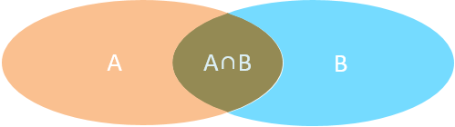

# MySql篇

### 基本语法

#### 查询

- 查询多个字段

```SQL
select 字段1, 字段2, 字段3 from  表名;
```

- 查询所有字段（通配符）（不推荐使用，会导致索引失效）

```SQL
select *  from  表名;
```

- 设置别名

```SQL
select 字段1 [ as 别名1 ] , 字段2 [ as 别名2 ]  from  表名;
```

- 去除重复记录

```SQL
select distinct 字段列表 from  表名;
```

- 条件查询

```SQL
select  字段列表  from   表名   where   条件列表 ; -- 条件列表：意味着可以有多个条件
```

学习条件查询就是学习条件的构建方式，而在SQL语句当中构造条件的运算符分为两类：

- 比较运算符
- 逻辑运算符

常用的比较运算符如下:

| 比较运算符          | 功能                                     |
| ------------------- | ---------------------------------------- |
| >                   | 大于                                     |
| >=                  | 大于等于                                 |
| <                   | 小于                                     |
| <=                  | 小于等于                                 |
| =                   | 等于                                     |
| <> 或 !=            | 不等于                                   |
| between ... and ... | 在某个范围之内(含最小、最大值)           |
| in(...)             | 在in之后的列表中的值，多选一             |
| like 占位符         | 模糊匹配(_匹配单个字符, %匹配任意个字符) |
| is null             | 是null                                   |

常用的逻辑运算符如下:

| 逻辑运算符 | 功能                        |
| ---------- | --------------------------- |
| and 或 &&  | 并且 (多个条件同时成立)     |
| or 或\|\|  | 或者 (多个条件任意一个成立) |
| not 或 !   | 非 , 不是                   |

常用聚合函数：

| 函数  | 功能     |
| ----- | -------- |
| count | 统计数量 |
| max   | 最大值   |
| min   | 最小值   |
| avg   | 平均值   |
| sum   | 求和     |

> count ：按照列去统计有多少行数据。
>
> - 在根据指定的列统计的时候，如果这一列中有null的行，该行不会被统计在其中。
>
> sum ：计算指定列的数值和，如果不是数值类型，那么计算结果为0
>
> max ：计算指定列的最大值
>
> min ：计算指定列的最小值
>
> avg ：计算指定列的平均值

- 分组查询

分组： 按照某一列或者某几列，把相同的数据进行合并输出。

> 分组其实就是按列进行分类(指定列下相同的数据归为一类)，然后可以对分类完的数据进行合并计算。
>
> 分组查询通常会使用聚合函数进行计算。

- 排序查询

语法：

```SQL
select  字段列表  from  表名  [where 条件]  group by 分组字段名  [having 分组后过滤条件];
```

排序在日常开发中是非常常见的一个操作，有升序排序，也有降序排序。

语法：

```SQL
select  字段列表  
from   表名   
[where  条件列表] 
[group by  分组字段 ] 
order  by  字段1  排序方式1 , 字段2  排序方式2 … ;
```

- 排序方式：

  - ASC ：升序（默认值）
  - DESC：降序
- 分页查询语法：

```SQL
select  字段列表  from   表名  limit  起始索引, 查询记录数 ;    /* 索引起始为0 */
```

### 多表查询

多表查询可以分为：

1. 连接查询
   - 内连接：相当于查询A、B交集部分数据



1. 外连接
   - 左外连接：查询左表所有数据(包括两张表交集部分数据)
   - 右外连接：查询右表所有数据(包括两张表交集部分数据)

```sql
SELECT
    [表别名1.]列名1, [表别名2.]列名2, ... -- 选择需要查询的列
FROM
    主表 [AS] 表别名1 -- 首先指定一个主表（或称为驱动表）
[连接类型] JOIN 连接表 [AS] 表别名2 -- 指定要连接的表和连接类型
    ON 连接条件 -- 这是最重要的部分，定义了两个表如何关联
[WHERE 过滤条件] -- 对连接后的结果集进行过滤
[GROUP BY 分组列] -- 分组
[HAVING 分组后的过滤条件] -- 对分组后的结果进行过滤
[ORDER BY 排序列]; -- 排序
```