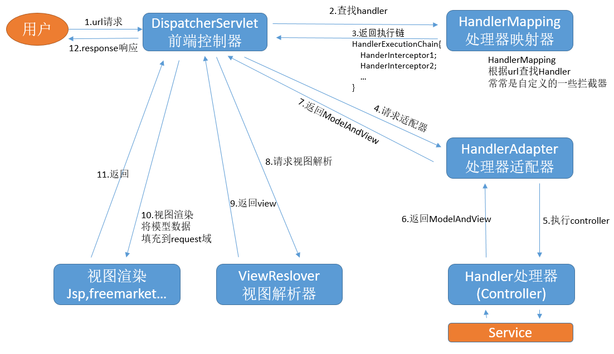
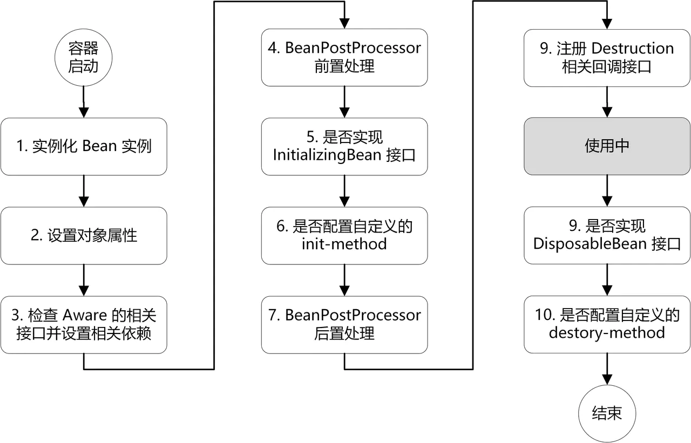

# Spring篇

## Spring注解

### 1. 注解的本质

注解本质上是一个接口，它继承自 `java.lang.annotation.Annotation`。使用 `@interface` 关键字来声明它，编译器会将其编译为一个接口。

**基本语法**

```java
import java.lang.annotation.*;
@Retention(RetentionPolicy.RUNTIME)  // 保留策略：运行时
@Target({ElementType.METHOD, ElementType.TYPE})  // 应用于方法和类
@Documented  // 是否生成 Javadoc 文档
public @interface MyAnnotation {
    String value() default "default";  // 注解属性
    int count() default 0;
}
```

### 2. 元注解 (Meta-Annotations)

在定义自己的注解之前，必须先了解 **元注解** 。元注解是用于修饰其他注解的注解，它们来自 `java.lang.annotation` 包，用来定义自定义注解的行为。

| 元注解                   | 作用                                                                                  |
| ------------------------ | ------------------------------------------------------------------------------------- |
| **`@Target`**    | **指定注解可以应用的地方** （如类、方法、字段等）。这是**必须**要设置的。 |
| **`@Retention`** | **指定注解的保留策略** （源码、编译期、运行时）。这是**必须**要设置的。   |
| `@Documented`          | 表明这个注解应该被 javadoc 工具记录，生成在 API 文档中。                              |
| `@Inherited`           | 表明该注解类型可以被自动继承。如果一个类用上了该注解，其子类会自动继承此注解。        |
| `@Repeatable`(Java 8+) | 表明注解可以在同一个声明上重复使用。                                                  |

 **`@Target` 的参数 (ElementType)** ：

* `ElementType.TYPE`：类、接口、枚举
* `ElementType.FIELD`：字段（包括枚举常量）
* `ElementType.METHOD`：方法
* `ElementType.PARAMETER`：形参
* `ElementType.CONSTRUCTOR`：构造器
* `ElementType.LOCAL_VARIABLE`：局部变量
* `ElementType.ANNOTATION_TYPE`：注解类型
* `ElementType.PACKAGE`：包
* `ElementType.TYPE_PARAMETER`(Java 8+)：类型参数
* `ElementType.TYPE_USE`(Java 8+)：类型使用

 **`@Retention` 的参数 (RetentionPolicy)** ：

* `RetentionPolicy.SOURCE`：仅存在于源码中，编译后就被丢弃（如 `@Override`, `@SuppressWarnings`）。
* `RetentionPolicy.CLASS`：存在于编译后的 `.class` 文件中，但不会被 JVM 运行时加载。 **这是默认策略，但不常用** 。
* `RetentionPolicy.RUNTIME`：存在于 `.class` 文件中，且会被 JVM 加载到运行时内存。 **可以通过反射读取** 。这是我们自定义注解最常用的策略。

### 3. 注解的元素 (Annotation Elements)

注解内部可以定义一些“属性”，看起来像接口的方法。

* **语法** ：`数据类型 属性名() [default 默认值];`
* **支持的数据类型** ：所有基本类型、`String`、`Class`、`enum`、注解，以及这些类型的数组。
* **如果注解只有一个属性** ，通常将其命名为 `value`。这样在使用时可以直接写 `@MyAnnotation("something")`，而不用写 `@MyAnnotation(value = "something")`。
* **使用 `default` 关键字可以为属性指定默认值** 。

## 自定义注解

### **1. 定义自定义注解**

自定义注解通过 `@interface` 关键字定义，并使用元注解（如 `@Retention`、`@Target`）配置其行为。

#### **1.1 基本语法**

```java
import java.lang.annotation.*;
@Retention(RetentionPolicy.RUNTIME)  // 保留策略：运行时
@Target({ElementType.METHOD, ElementType.TYPE})  // 应用于方法和类
@Documented  // 是否生成 Javadoc 文档
public @interface MyAnnotation {
    String value() default "default";  // 注解属性
    int count() default 0;
}
```


#### **1.2 元注解说明**

* **`@Retention`** ：定义注解的生命周期。
* `RetentionPolicy.SOURCE`：仅保留在源代码中（编译时丢弃）。
* `RetentionPolicy.CLASS`：保留在 class 文件中，但不被虚拟机保留。
* `RetentionPolicy.RUNTIME`：保留在运行时，可通过反射读取（常用）。
* **`@Target`** ：定义注解的适用范围。
* `ElementType.TYPE`：类、接口、枚举。
* `ElementType.METHOD`：方法。
* `ElementType.FIELD`：字段。
* `ElementType.PARAMETER`：方法参数。
* 等等。
* **`@Documented`** ：注解是否被包含在 Javadoc 中。
* **`@Inherited`** ：子类是否继承父类的注解。

### 2.注解的处理

定义注解只是第一步，如何处理它才是关键。主要有三种方式：

1. #### **运行时反射（Reflection）**


   * 最基础的方式，通过 `Class`， `Method`， `Field` 等的 `getAnnotation()` 或 `getAnnotations()` 方法获取注解信息。
   * **优点** ：灵活。
   * **缺点** ：代码侵入性强，需要手动编写反射逻辑，性能稍差。

   ```java
   // 处理器示例
   public void processAnnotation(Object target) {
       Class<?> clazz = target.getClass();
       for (Method method : clazz.getMethods()) {
           if (method.isAnnotationPresent(MyCustomAnnotation.class)) {
               MyCustomAnnotation annotation = method.getAnnotation(MyCustomAnnotation.class);
               System.out.println("Found annotation on method: " + method.getName());
               System.out.println("Value is: " + annotation.value());
               // ... 执行你的自定义逻辑
           }
       }
   }
   ```
2. #### **Spring AOP（面向切面编程） - 最常用**


   * 为带有自定义注解的方法创建一个切面（Aspect），通过切入点表达式（Pointcut）匹配注解，然后在通知（Advice）中编写处理逻辑。
   * **优点** ：非侵入式，逻辑集中，与业务代码完全解耦。
   * **缺点** ：需要理解 AOP 概念。

   ```java
   @Aspect
   @Component
   public class MyCustomAnnotationAspect {

       // 定义切入点：所有被@MyCustomAnnotation注解的方法
       @Pointcut("@annotation(com.example.MyCustomAnnotation)")
       public void pointcut() {}

       // 环绕通知：在方法执行前后处理
       @Around("pointcut()")
       public Object around(ProceedingJoinPoint joinPoint) throws Throwable {
           MethodSignature signature = (MethodSignature) joinPoint.getSignature();
           Method method = signature.getMethod();
           MyCustomAnnotation annotation = method.getAnnotation(MyCustomAnnotation.class);

           // 前置逻辑
           System.out.println("Before method with value: " + annotation.value());

           // 执行原方法
           Object result = joinPoint.proceed();

           // 后置逻辑
           System.out.println("After method execution.");
           return result;
       }
   }
   ```
3. #### **`BeanPostProcessor` 接口**


   * 用于在 Spring Bean 初始化前后进行处理。可以检查类级别（`@Target(ElementType.TYPE)`）的注解。
   * **优点** ：非常强大，可以在 Bean 生命周期的早期进行干预。
   * **缺点** ：粒度较粗，通常用于处理类级别的注解。

   ```java
   @Component
   public class MyClassAnnotationProcessor implements BeanPostProcessor {

       @Override
       public Object postProcessBeforeInitialization(Object bean, String beanName) throws BeansException {
           Class<?> clazz = bean.getClass();
           if (clazz.isAnnotationPresent(MyClassLevelAnnotation.class)) {
               MyClassLevelAnnotation annotation = clazz.getAnnotation(MyClassLevelAnnotation.class);
               // ... 对Bean进行处理，例如注入一些元数据
           }
           return bean;
       }
   }
   ```
4. #### **`HandlerInterceptor` (拦截器)**


   * 主要用于处理 Web 请求，可以拦截带有自定义注解的 Controller 方法。
   * **优点** ：适合处理Web请求相关的横切关注点（如权限、日志）。

   ```java
   public class MyAuthInterceptor implements HandlerInterceptor {

       @Override
       public boolean preHandle(HttpServletRequest request, HttpServletResponse response, Object handler) throws Exception {
           if (handler instanceof HandlerMethod) {
               HandlerMethod handlerMethod = (HandlerMethod) handler;
               // 检查方法上的注解
               if (handlerMethod.hasMethodAnnotation(RequiresAuth.class)) {
                   // 执行权限检查逻辑
                   if (!checkAuth(request)) {
                       response.sendError(401, "Unauthorized");
                       return false;
                   }
               }
           }
           return true;
       }
   }
   ```

   * 别忘了在 WebMvc 配置中注册这个拦截器。

### 总结

| 方面           | 技术选型                             | 说明                           |
| -------------- | ------------------------------------ | ------------------------------ |
| **定义** | 元注解 (`@Target`, `@Retention`) | 确定注解作用目标和生命周期     |
| **处理** | **Spring AOP** (最常用)        | 处理方法级注解，解耦           |
|                | `BeanPostProcessor`                | 处理类级注解，介入Bean生命周期 |
|                | `HandlerInterceptor`               | 处理Web请求相关注解            |
|                | 反射 (Fallback)                      | 灵活但侵入性强                 |
| **场景** | 日志、权限、缓存、事务等             | 实现声明式编程                 |
| **注意** | 代理失效、组合注解                   | 常见问题与高级技巧             |

## Spring mvc



## Spring Bean 的生命周期



Spring bean 一个完整的生命周期包含下面 10个阶段：

1. **实例化（Instantiation）**

   容器通过反射机制创建一个 Bean 的实例。
2. **属性赋值（Populate Properties）** ：

   容器将 Bean 的属性值（包括依赖注入的其他 Bean）设置到新创建的实例中。
3. **BeanNameAware 接口回调** ：

   如果 Bean 实现了 `BeanNameAware` 接口，容器会调用 `setBeanName(String name)` 方法，传递当前 Bean 的名称。
4. **BeanFactoryAware 接口回调** ：

   如果 Bean 实现了 `BeanFactoryAware` 接口，容器会调用 `setBeanFactory(BeanFactory beanFactory)` 方法，传递当前的 BeanFactory 实例。
5. **ApplicationContextAware 接口回调** ：

   如果 Bean 实现了 `ApplicationContextAware` 接口，容器会调用 `setApplicationContext(ApplicationContext applicationContext)` 方法，传递当前的 ApplicationContext 实例。
6. **BeanPostProcessor 前置处理** ：

   容器调用所有注册的 `BeanPostProcessor` 的 `postProcessBeforeInitialization(Object bean, String beanName)` 方法。
7. **初始化（Initialization）** ：

   如果 Bean 实现了 `InitializingBean` 接口，容器会调用 `afterPropertiesSet()` 方法。

   如果 Bean 在配置文件中通过 `init-method` 属性指定了初始化方法，容器会调用该方法。
8. **BeanPostProcessor 后置处理** ：

   容器调用所有注册的 `BeanPostProcessor` 的 `postProcessAfterInitialization(Object bean, String beanName)` 方法。
9. **使用（Usage）** ：

   此时 Bean 已经完成初始化，可以被应用程序使用。
10. **销毁（Destruction）** ：

    如果 Bean 实现了 `DisposableBean` 接口，容器会调用 `destroy()` 方法。

    如果 Bean 在配置文件中通过 `destroy-method` 属性指定了销毁方法，容器会调用该方法。

### 原理

Spring Bean 生命周期的管理主要依赖于 Spring 的 IoC（Inversion of Control，控制反转）容器。这个容器负责创建、初始化、配置和销毁 Bean。通过配置文件或注解，开发者可以定义 Bean 的依赖关系和生命周期回调方法。

Spring 通过 `BeanFactory` 和 `ApplicationContext` 接口提供了对 Bean 生命周期的控制。`ApplicationContext` 是 `BeanFactory` 的一个子接口，提供了更多高级特性，如事件发布、国际化等。
